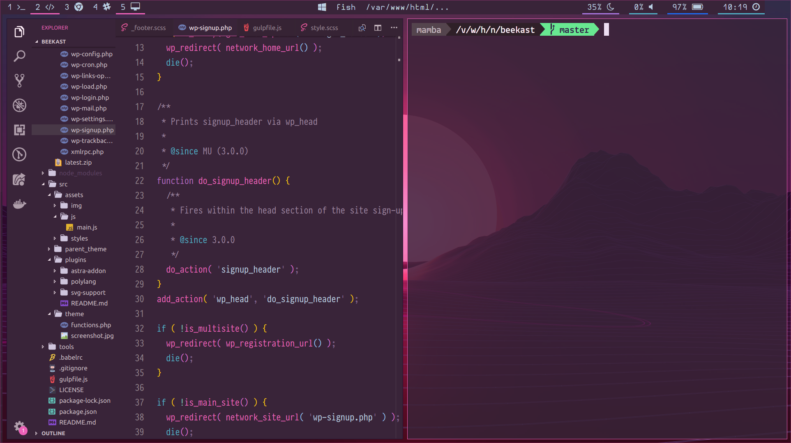

# Ubuntu 18.04 (Beaver) + i3 

## Screen


## Tearing Ubuntu
```
sudo touch /etc/X11/xorg.conf

Section "Device"
   Identifier  "Intel Graphics"
   Driver      "intel"
   Option      "AccelMethod" "sna"
   Option      "TearFree" "true"
EndSection
```

## Rofi

theme is in .Xresources

```
sudo apt-get install rofi
cp git/.Xresources ~/.Xresources
```

Tweaking GTK app :
``
sudo apt install lxappearance 
``

Window Info / Kill: 
```
xprop / xkill
```

Reload Xresources : 
xrdb ~/.Xresources


## Icons

Pop icon theme : 

```
sudo add-apt-repository ppa:system76/pop

sudo apt-get update

sudo apt install pop-icon-theme
```

## Fish

```
sudo apt-add-repository ppa:fish-shell/release-2
sudo apt-get update
sudo apt-get install fish
sudo chsh -s /bin/fish
```

## OhMyFish 

```
sudo apt-get install curl git
curl -L https://get.oh-my.fish | fish
omf install eclm
omf theme eclm
omf install ocean
```

## Git

```
clé SHA
installer hub
if asking for pwd -> sudo nano .git/config -> ssh://git@github.com/username/repo.git
```

## Sound

```
sudo add-apt-repository ppa:nilarimogard/webupd8
sudo apt-get update
sudo apt-get install pulseaudio-equalizer
```

## Server

```
sudo apt install apache2 php mysql-server libapache2-mod-php php-mysql
sudo apt-get install phpmyadmin
```

Apache not working might be : 
```
sudo nano /etc/apache2/apache2.conf
```
and change line :
```
<Directory /var/www>
```
to
   ```
<Directory /var/www/html> AllowOverride All
```

## Notifications
Using Dunst 
```
cp git/.config/dunst/dunstrc ~/.config/dunst/dunstrc
```

## Compton
For animations & transparency
```
cp git/.config/compton.conf ~/.config/compton.conf
```

